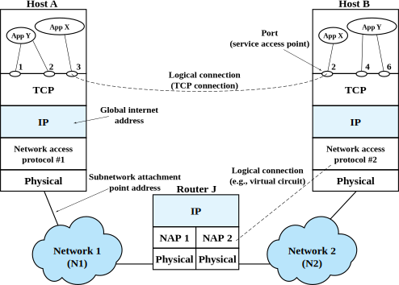

# Programming with Java Sockets

In this tutorial, you will learn how to use the socket API to transfer data across a network. This version of the tutorial uses Java sockets. It should take you about 90 minutes to work through this tutorial.

Before you can run lab experiments on CloudLab, you will need to set up an account and join a project under the supervision of a research advisor or a course instructor. If you haven't set up your CloudLab account yet, follow the instructions in [Hello, CloudLab](https://teaching-on-testbeds.github.io/hello-cloudlab/) to do so.

Attribution: the sample code in this exercise is based on "Computer Networking: A Top Down Approach" by Kurose and Ross. For more information on the Java code, please refer to [this chapter from Kurose and Ross](https://gaia.cs.umass.edu/kurose_ross/programming/simple_socket/K_R_sockets_in_Java.pdf).

## Background: the socket API

The image below shows a "logical connection" between an application, App X, on a host named Host A, and an application, App X, on another host named Host B. 


_Image from William Stallings, "Data and Computer Communications"_

These hosts are on different networks, and all of the layers of the TCP/IP protocol stack are involved in transferring data across this "logical connection". When App X on Host A has data to send, it will be transferred down the network protocol stack; across Network 1; through Router J; across Network 2; and up the protocol stack on Host B until it reaches App X. However, these details are hidden from the application: as far as each application is concerned, it can directly send and receive data across this "logical connection".

This is enabled by the **socket API**! The socket API is a programming interface that connects the application layer to the transport layer and from there, the rest of the TCP/IP protocol stack. It manages the various buffers that are used to transfer data between the network protocol stack and the application, and allows the application to use the network just by calling basic, intuitive functions like "send" and "receive".

Since there are two major transport layer protocols - UDP and TCP - there are two ways to use the socket API! In the next section, we will describe the steps involved in sending and receiving data over a UDP socket, and in the following section, we will describe the steps involved in sending and receiving data over a TCP socket.

### UDP sockets

UDP is a very simple transport protocol. It adds a small header to the payload, then sends it directly to a target host, without establishing a connection first. This is in contrast to the other major transport protocol, TCP, which is a connection-oriented protocol.

This makes UDP very easy to use!

To *send* data with UDP, an application should:

1. Create a UDP socket
2. (Optional) `bind` to the *local* IP address and UDP port that the socket should use. (If you don't, the operating system will select a random large port number for you.)
3. `send` data, by specifying the data to send and the *destination* IP address and port.

To *receive* data, an application should:

1. Create a UDP socket
2. `bind` to the *local* IP address and UDP port that the socket should use. (This can happen at the same time that the socket is created, or in a separate function call.)
3. `receive` data from the socket *buffer*, where the operating system will have put any data that was passed up the network protocol stack for this UDP port.

Later in this exercise, we will see how this works with a sample Java program.


### TCP sockets

TCP sockets have a few more steps, because unlike UDP, TCP is a connection-oriented protocol. Therefore, the TCP socket API also includes functions for establishing a connection and for closing a connection.

Any data transfer with TCP starts with **connection establishment**. Of the two communication endpoints, one will `listen` for incoming connections and the other will use `connect` to initiate the connection. The host that listens is known as the *server*, and the host that initiates the connection is called the *client*.

First, the server should:

1. Create a TCP socket.
2. `bind` to the *local* IP address and TCP port that the socket should use, and `listen` for incoming connections on the socket.
3. Call `accept`, which won't send anything over the network, but will wait until there is an incoming connection. When a connection is initiated by the client, `accept` will spin off a *new* socket which will be used for the connection to this host.

The client will then:

1. Create a TCP socket.
2. (Optional) The client may `bind` to the *local* IP address and TCP port. This is optional - if there is no explicit call to `bind`, the operating system will assign a random TCP port to this socket in the next step.
3. Call `connect`, specifying the *destination* IP address and port. This instructs the TCP transport layer to execute the connection establishment process, which involved sending messages known as the "three-way handshake" between client and server. (In Java, this will happen automatically when we create a `Socket` and specify the address of the remote endpoint.)

Once connection establishment is complete, and the connection is ongoing, the client and server applications can use two more socket API calls to transfer data:

1. `write` or `send` to put data into the send socket buffer, from which the operating system will stream data across the connection. The data segment will be delivered to the receive socket buffer at the other endpoint. 
2. `read` or `receive` to read data from the receive socket buffer.


Finally, the client or server can use the `close` socket API call to indicate that it wants to close the connection.

Later in this exercise, we will see how this works with a sample Java program.

## Run my experiment

Now that you know all about sockets, you are ready to set up a network of hosts and use the socket API to exchange data among them!

### Reserve and log in to resources on CloudLab

For this experiment, we will use the CloudLab profile available at the following link: [https://www.cloudlab.us/p/cl-education/sockets-java](https://www.cloudlab.us/p/cl-education/sockets-java)

If you visit this link, you'll see a brief description of the profile. Click "Next". On the following page, you'll see a diagram of your experiment topology (on the right - in this case, two hosts connected to a common network), and on the left you'll be asked to select the "Cluster" on which you want your experiment to run.

This experiment can run on any cluster. However, since CloudLab is a shared resource, on some occasions the cluster you select might not have enough available resources to support your experiment. The status indicator next to each cluster tells you roughly how heavily utilized it is at the moment - green indicates that there are not many users, orange means heavy load, and red means that it is almost fully utilized. You are more likely to be successful if you choose a cluster with a green indicator.

After you select a cluster, you can leave the "Name" field blank, or give your experiment a name - it's your choice. Also make sure your "Project" is selected. Then, click "Next".

On the last page, you'll be asked to set the duration of your experiment. At the end of this duration, your resources will be deleted automatically - so make sure to give yourself enough time to finish.

You can leave the start date/time on this page blank if you are ready to work on the experiment right now. 

When you have made all your choices, click "Finish" to ask CloudLab to reserve resources according to your configuration.

Once you have successfully instantiated a profile, it will still take some time before your resources are ready for you to log in.

As your resources come online, you'll see their progress on the CloudLab experiment page. Once each host in your experiment is "green" and has a "✓" icon in the top right corner, it is ready for you to log in! 

For this experiment, you will need a terminal or VNC session on the "romeo" and "juliet" hosts. You can use any method you prefer:

* Open an SSH session using the terminal in the CloudLab web portal
* Open an SSH session using a terminal application that is installed on your laptop or PC
* Open a VNC session (for a graphical interface)

(You can refer back to the [Hello, CloudLab](https://teaching-on-testbeds.github.io/hello-cloudlab/) experiment, if you don't remember how to open a terminal session or a VNC session!)

### Network configuration

Run

```
ifconfig
```

on each host, "romeo" and "juliet", and make a note of their respective IPv4 addresses. You should see that "romeo" has an interface that uses the IPv4 address 10.10.0.100, and "juliet" has an interface that uses the IPv4 address 10.10.0.101.

### Transfer data across UDP sockets

In this exercise, we will write a UDP server application on "juliet", and a UDP client application "romeo".  We will need a text editor on the remote host to write Java code.

You can either:

* use `nano` or any other terminal-based text editor in the terminal on the host, or
* in the VNC session on either host, run `leafpad` in the terminal to open a graphical text editor.

We will start on "juliet". Once you have a text editor open, start by setting up your class:

```java
import java.io.*;
import java.net.*;

class UDPServer
{
   public static void main(String args[]) throws Exception
      {

        // Our UDP socket code will go here!

      }
}
```


Now, we'll fill in code to

* create a UDP socket. Note that this is a `DatagramSocket`; TCP sockets will be a different type. We could pass a port number as an argument to the constructor, and then it would bind to that UDP port. Or, we could pass no arguments to the constructor, and the operating system would give the socket a random available UDP port. In this case, we pass `null` to the constructor, indicating that the socket should not be bound yet.
* specify the address and port to which we want to bind. Note that `10.10.0.101` is "juliet"'s own IP address, and 4000 is an available UDP port. (We could use *any* available UDP port!)
* call the socket API function `bind` to reserve this address and port combination for our socket.

Here's the updated code:

```java
import java.io.*;
import java.net.*;

class UDPServer
{
   public static void main(String args[]) throws Exception
      {
         DatagramSocket serverSocket = new DatagramSocket(null);
         InetSocketAddress IPBindAddress = new InetSocketAddress("10.10.0.101", 4000);
         serverSocket.bind(IPBindAddress);

        // More UDP socket code will go here!

      }
}
```

Finally, we're going to `receive` UDP datagrams, and `send` them back with the text converted to uppercase. Here is the updated code: 


```java
import java.io.*;
import java.net.*;

class UDPServer
{
   public static void main(String args[]) throws Exception
      {
         DatagramSocket serverSocket = new DatagramSocket(null);
         InetSocketAddress IPBindAddress = new InetSocketAddress("10.10.0.101", 4000);
         serverSocket.bind(IPBindAddress);

	      byte[] receiveData = new byte[1024];
         byte[] sendData = new byte[1024];
         while(true)
               {
                  DatagramPacket receivePacket = new DatagramPacket(receiveData, receiveData.length);
                  serverSocket.receive(receivePacket);
                  String sentence = new String( receivePacket.getData());
                  System.out.println("RECEIVED: " + sentence);
                  InetAddress IPAddress = receivePacket.getAddress();
                  int port = receivePacket.getPort();
                  String capitalizedSentence = sentence.toUpperCase();
                  sendData = capitalizedSentence.getBytes();
                  DatagramPacket sendPacket = new DatagramPacket(sendData, sendData.length, IPAddress, port);
                  serverSocket.send(sendPacket);
               }
      }
}
```

Once your code on "juliet" looks like the example above, you can save it in a file `UDPServer.java`. Then, in the terminal on "juliet", compile it with 


```
javac UDPServer.java
```

Before we can test this code, we'll need to set up the equivalent client code on the other endpoint. 

On "romeo", open a text editor, and fill in the code


```java
import java.io.*;
import java.net.*;

class UDPClient
{
   public static void main(String args[]) throws Exception
   {
      BufferedReader inFromUser =
      new BufferedReader(new InputStreamReader(System.in));
      DatagramSocket clientSocket = new DatagramSocket();
      InetSocketAddress IPAddress = new InetSocketAddress("10.10.0.101", 4000);
      byte[] sendData = new byte[1024];
      byte[] receiveData = new byte[1024];
      String sentence = inFromUser.readLine();
      sendData = sentence.getBytes();
      DatagramPacket sendPacket = new DatagramPacket(sendData, sendData.length, IPAddress);
      clientSocket.send(sendPacket);
      DatagramPacket receivePacket = new DatagramPacket(receiveData, receiveData.length);
      clientSocket.receive(receivePacket);
      String modifiedSentence = new String(receivePacket.getData());
      System.out.println("FROM SERVER:" + modifiedSentence);
      clientSocket.close();
   }
}
```

Save it as `UDPClient.java`. Then, in a terminal on "romeo", compile it with

```
javac UDPClient.java
```

Now you are ready to transfer some data across these sockets! On "juliet" run

```
java UDPServer
```

and leave it running; on "romeo", run


```
java UDPClient
```

On "romeo", type a line of text and hit Enter. You should see this line of text appear on "juliet"; then, "juliet" will send that line of text, but in uppercase, back to "romeo".

You can use Ctrl+C to stop the server process on "juliet".

### Transfer data across TCP sockets

Next, we will write a TCP server application on "juliet", and a TCP client application "romeo".  We will need a text editor on the remote host to write Java code.

You can either:

* use `nano` or any other terminal-based text editor in the terminal on the host, or
* in the VNC session on either host, run `leafpad` in the terminal to open a graphical text editor.

We will start on "juliet". Once you have a text editor open, start by setting up your class:

```java
import java.io.*;
import java.net.*;

class TCPServer {
 public static void main(String argv[]) throws Exception {

   // Our TCP socket code will go here!

 }
}
```


Now, we'll fill in code to

* create a TCP socket. Note that this is a `ServerSocket` type.  
* specify the address and port to which we want to bind. Note that `10.10.0.101` is "juliet"'s own IP address, and 4000 is an available TCP port. (We could use *any* available TCP port!)
* call the socket API function `bind` to reserve this address and port combination for our socket.

We will also define a couple of `String` variables here.

Here's the updated code:

```java
import java.io.*;
import java.net.*;

class TCPServer {
 public static void main(String argv[]) throws Exception {

  String clientSentence;
  String capitalizedSentence;
  ServerSocket welcomeSocket = new ServerSocket();
  InetSocketAddress IPBindAddress = new InetSocketAddress("10.10.0.101", 4000);
  welcomeSocket.bind(IPBindAddress);

  // More TCP socket code will go here!


 }
}
```

Next, we'll add code so that when the client tries to connect, we `accept` the connection:


```java
import java.io.*;
import java.net.*;

class TCPServer {
 public static void main(String argv[]) throws Exception {

  String clientSentence;
  String capitalizedSentence;
  ServerSocket welcomeSocket = new ServerSocket();
  InetSocketAddress IPBindAddress = new InetSocketAddress("10.10.0.101", 4000);
  welcomeSocket.bind(IPBindAddress);

  while (true) {
   Socket connectionSocket = welcomeSocket.accept();

    // More TCP socket code will go here!

  }
 }
}
```

Finally, we're going to `read` messages from the socket, and `write` them back with the text converted to uppercase. Here is the updated code: 


```java
import java.io.*;
import java.net.*;

class TCPServer {
 public static void main(String argv[]) throws Exception {
  String clientSentence;
  String capitalizedSentence;
  ServerSocket welcomeSocket = new ServerSocket();
  InetSocketAddress IPBindAddress = new InetSocketAddress("10.10.0.101", 4000);
  welcomeSocket.bind(IPBindAddress);


  while (true) {
   Socket connectionSocket = welcomeSocket.accept();
   BufferedReader inFromClient =
    new BufferedReader(new InputStreamReader(connectionSocket.getInputStream()));
   DataOutputStream outToClient = new DataOutputStream(connectionSocket.getOutputStream());
   clientSentence = inFromClient.readLine();
   System.out.println("Received: " + clientSentence);
   capitalizedSentence = clientSentence.toUpperCase() + '\n';
   outToClient.writeBytes(capitalizedSentence);
  }
 }
}
```

Once your code on "juliet" looks like the example above, you can save it in a file `TCPServer.java`. Then, in the terminal on "juliet", compile it with 


```
javac TCPServer.java
```

Before we can test this code, we'll need to set up the equivalent client code on the other endpoint. 

On "romeo", open a text editor, and fill in the code


```java
import java.io.*;
import java.net.*;

class TCPClient {
 public static void main(String argv[]) throws Exception {
  String sentence;
  String modifiedSentence;
  BufferedReader inFromUser = new BufferedReader(new InputStreamReader(System.in));
  Socket clientSocket = new Socket("10.10.0.101", 4000);
  DataOutputStream outToServer = new DataOutputStream(clientSocket.getOutputStream());
  BufferedReader inFromServer = new BufferedReader(new InputStreamReader(clientSocket.getInputStream()));
  sentence = inFromUser.readLine();
  outToServer.writeBytes(sentence + '\n');
  modifiedSentence = inFromServer.readLine();
  System.out.println("FROM SERVER: " + modifiedSentence);
  clientSocket.close();
 }
}
```

Note that on the client, we create a socket of type `Socket`, and we specify the address of the other endpoint - it will attempt to `connect` immediately when we do so.

Save this as `TCPClient.java`. Then, in a terminal on "romeo", compile it with

```
javac TCPClient.java
```

Now you are ready to transfer some data across these sockets! On "juliet" run

```
java TCPServer
```

and leave it running; on "romeo", run


```
java TCPClient
```

On "romeo", type a line of text and hit Enter. You should see this line of text appear on "juliet"; then, "juliet" will send that line of text, but in uppercase, back to "romeo".

You can use Ctrl+C to stop the server process on "juliet".


## Exercise

Write a Java application on "romeo" and "juliet" to exchange the following dialogue between the two hosts:

```text
ROMEO

    She speaks:
    O, speak again, bright angel! for thou art
    As glorious to this night, being o'er my head
    As is a winged messenger of heaven
    Unto the white-upturned wondering eyes
    Of mortals that fall back to gaze on him
    When he bestrides the lazy-pacing clouds
    And sails upon the bosom of the air.

JULIET
    O Romeo, Romeo! wherefore art thou Romeo?
    Deny thy father and refuse thy name;
    Or, if thou wilt not, be but sworn my love,
    And I'll no longer be a Capulet.
```

and print each line of dialogue as it is sent and received at each host.

To write Java code, you can either:

* use `nano` or any other terminal-based text editor in the terminal on the host, or
* in the VNC session on either host, run `leafpad` in the terminal to open a graphical text editor.

Save your Java code using your preferred editor on "romeo" and "juliet".  Then, compile and test it - verify that the entire message is transferred correctly.

See if you can write both a UDP and TCP version of this code!

## Release resources

When you are finished with this experiment, use the "Terminate" button on the experiment page in the CloudLab web portal to release your resources and free them for other experimenters.

---

<small>Questions about this material? Contact Fraida Fund</small>

---

<small>This material is based upon work supported by the National Science Foundation under Grant No. 2231984.</small>
<small>Any opinions, findings, and conclusions or recommendations expressed in this material are those of the author(s) and do not necessarily reflect the views of the National Science Foundation.</small>
